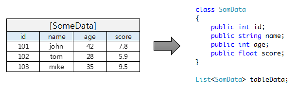
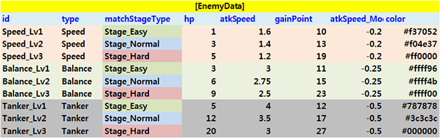
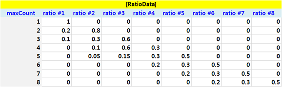
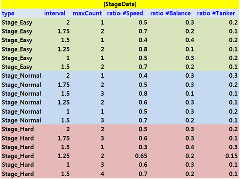
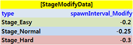

# ExcelToObject #

Read excel file into C# object.

## Features ##
* Unity 4/5 compatible (uses DotNet Framework 2)
* Single DLL
* Support [Office Open XML](https://en.wikipedia.org/wiki/Office_Open_XML) format (`.xlsx`)
* MIT License

## Usage ##

#### #1) Simple case ####
* Read table into `List<T>`

**Table**

**Code**

    public class EnemyData
    {
    	public string id;
    	public EnemyType type;
    	public StageType matchStageType;
    	public int hp;
    	public float atkSpeed;
    	public int gainPoint;
    	public float atkSpeed_Modify;
    	public string color;
    }
     
    public void LoadFromExcel(string filePath)
    {
    	var excelReader = new ExcelToObject.ExcelReader(filePath);
    	List<EnemyData> enemy = excelReader.ReadList<EnemyData>("EnemyData");
    }

#### #2) Array/List case ####
* A property can be a array or `List<T>`
* It consists with same column name.
* Column name can be distinguished by '#' notation. (postfix after '#' is ignored)

**Table**

**Code**

    public class RatioData
    {
    	public int maxCount;
    	public float[] ratio;
    }
     
    List<RatioData> ratio = excelReader.ReadList<RatioData>("RatioData");

#### #3) Dictionary case ####
* A property can be a `Dictionary<TKey,TValue>`
* It consists with same column name.
* Key value is specified in '#' postfix
* Key can be any type which is convertible to.

**Table**
 

**Code**

    public class StagePhaseData
    {
    	public StageType type;
    	public float interval;
    	public int maxCount;
    	public float ratio_Npc;
    	public Dictionary<EnemyType, float> ratio;
    }
     
    var stagePhase = excelReader.ReadList<StagePhaseData>("StageData");

#### #4) Result can be `Dictionary<TKey,T>` ####
* Result can be `Dictionary<TKey, TValue>`
* Specify key column name for dictionary.

**Table**
 

**Code**

    public class ModData
    {
    	public float spawnInterval_Modify;
    }
     
    Dictionary<StageType, ModData> modData;
    modData = excelReader.ReadDictionary<StageType, ModData>("StageModifyData", "type");

## Details ##

#### ExcelReader ####
* Entry point for excel data reading.

        ExcelReader reader = new ExcelReader("test.xlsx");

* Contains excel sheet lists.

        var sheet = reader.Sheet[0];

#### SheetData ####
* Represents excel sheet data in row-column access pattern.

        var cell = sheetData[row, column];

* Can be used to search table by name

        var table = sheetData.FindTable("TableName");

#### Table ####
* Manipulate excel 

## License ##
> MIT License

Refer to [License](LICENSE) file

## Download ##

> [ExcelToObject.dll](binaries/ExcelToObject.dll)

 

`EOF`
